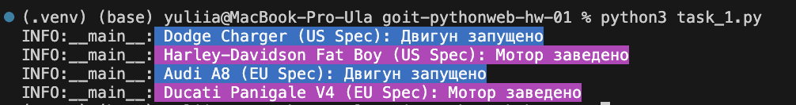
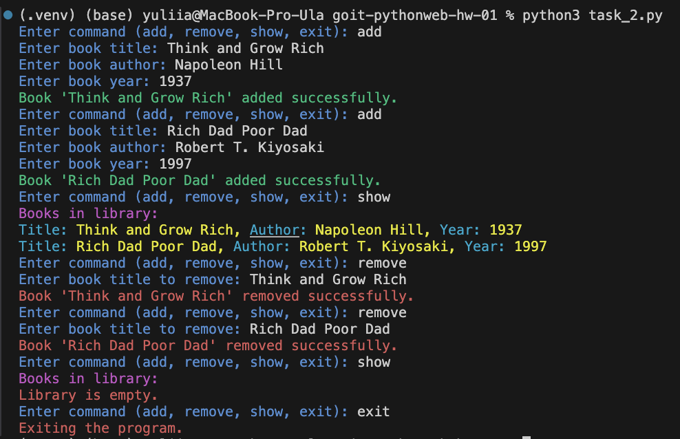

# Тема 1. Домашня робота

Прийшов час практики. У домашній роботі буде два завдання. В обох завданнях
необхідно застосувати типізацію. Замість оператора print слід використовувати
логування на рівні `INFO`. Для форматування коду використовуйте **black**.

# Технічний опис завдань

## Завдання 1. Патерн фабрика

Наступний код представляє просту систему для створення транспортних засобів. У
нас є два класи: `Car` та `Motorcycle`. Кожен клас має метод `start_engine()`,
який імітує запуск двигуна відповідного транспортного засобу. Наразі, щоб
створити новий транспортний засіб, ми просто створюємо екземпляр відповідного
класу з вказаними маркою (`make`) та моделлю (`model`).

```python
class Car:
def __init__(self, make, model):
self.make = make
self.model = model

    def start_engine(self):
        print(f"{self.make} {self.model}: Двигун запущено")

class Motorcycle:
def **init**(self, make, model):
self.make = make
self.model = model

    def start_engine(self):
        print(f"{self.make} {self.model}: Мотор заведено")

# Використання

vehicle1 = Car("Toyota", "Corolla")
vehicle1.start_engine()

vehicle2 = Motorcycle("Harley-Davidson", "Sportster")
vehicle2.start_engine()
```

Наступним кроком потрібно створювати транспортні засоби з урахуванням
специфікацій різних регіонів наприклад, для США `US Spec` та ЄС `EU Spec`.

**Ваше завдання** — реалізувати патерн фабрика, який дозволить створювати
транспортні засоби з різними регіональними специфікаціями, не змінюючи основні
класи транспортних засобів.

### Ход виконання завдання 1:

Створити абстрактний базовий клас `Vehicle` з методом `start_engine()`. Змінити
класи `Car` та `Motorcycle`, щоб вони успадковувались від `Vehicle`. Створити
абстрактний клас `VehicleFactory` з методами `create_car()` та
`create_motorcycle()`. Реалізувати два класи фабрики: `USVehicleFactory` та
`EUVehicleFactory`. Ці фабрики повинні створювати автомобілі та мотоцикли з
позначкою регіону наприклад, `Ford Mustang (US Spec)` відповідно для США.
Змініть початковий код так, щоб він використовував фабрики для створення
транспортних засобів.

### Очікуваний результат

Код, що дозволяє легко створювати транспортні засоби для різних регіонів,
використовуючи відповідні фабрики.

## Завдання 2. SOLID

Перед вами спрощена програма для керування бібліотекою книг. Програма має
можливість додавання нових книг, видалення книг та відображення всіх книг у
бібліотеці. Користувач має змогу взаємодіяти з програмою через командний рядок,
використовуючи команди `add`, `remove`, `show` та `exit`.

```python
class Library:
def __init__(self):
self.books = []

    def add_book(self, title, author, year):
        book = {
            "title": title,
            "author": author,
            "year": year
        }
        self.books.append(book)

    def remove_book(self, title):
        for book in self.books:
            if book["title"] == title:
                self.books.remove(book)
                break

    def show_books(self):
        for book in self.books:
            print(f'Title: {book["title"]}, Author: {book["author"]}, Year: {book["year"]}')

def main():
library = Library()

    while True:
        command = input("Enter command (add, remove, show, exit): ").strip().lower()

        if command == "add":
            title = input("Enter book title: ").strip()
            author = input("Enter book author: ").strip()
            year = input("Enter book year: ").strip()
            library.add_book(title, author, year)
        elif command == "remove":
            title = input("Enter book title to remove: ").strip()
            library.remove_book(title)
        elif command == "show":
            library.show_books()
        elif command == "exit":
            break
        else:
            print("Invalid command. Please try again.")

if __name__ == "__main__":
main()
```

**Ваше завдання** — переписати код, щоб він відповідав принципам SOLID.

### Ход виконання завдання 2:

1. Щоб виконати принцип єдиної відповідальності (SRP), створіть клас `Book`,
   який відповідатиме за зберігання інформації про книгу.
2. Щоб забезпечити принцип відкритості/закритості (OCP), зробіть так, щоб клас
   `Library` міг бути розширений для нової функціональності без зміни його коду.
3. Щоб виконати принцип підстанови Лісков (LSP), переконайтеся, що будь-який
   клас, який наслідує інтерфейс `LibraryInterface`, може замінити клас
   `Library` без порушення роботи програми.
4. Щоб виконати принцип розділення інтерфейсів (ISP), використовуйте інтерфейс
   `LibraryInterface` для чіткої специфікації методів, які необхідні для роботи
   з бібліотекою `library`.
5. Щоб виконати принцип інверсії залежностей (DIP), зробіть так, щоб класи
   вищого рівня, такі як `LibraryManager`, залежали від абстракцій
   (інтерфейсів), а не від конкретних реалізацій класів.

```python
from abc import ABC, abstractmethod

class Book:
pass

class LibraryInterface(ABC):
pass

class Library(LibraryInterface):
pass

class LibraryManager:
pass

def main():
library = Library()
manager = LibraryManager(library)

    while True:
        command = input("Enter command (add, remove, show, exit): ").strip().lower()

        match command:
            case "add":
                title = input("Enter book title: ").strip()
                author = input("Enter book author: ").strip()
                year = input("Enter book year: ").strip()
                manager.add_book(title, author, year)
            case "remove":
                title = input("Enter book title to remove: ").strip()
                manager.remove_book(title)
            case "show":
                manager.show_books()
            case "exit":
                break
            case _:
                print("Invalid command. Please try again.")

if __name__ == "__main__":
main()
```

## Підготовка та завантаження домашнього завдання

1. Створіть публічний репозиторій `goit-pythonweb-hw-01`.
2. Виконайте завдання та відправте його у свій репозиторій.
3. Завантажте робочі файли на свій комп’ютер та прикріпіть їх у LMS у форматі
   `zip`. Назва архіву повинна бути у форматі ДЗ1_ПІБ.
4. Прикріпіть посилання на репозиторій `goit-pythonweb-hw-01` та відправте на
   перевірку.

## Формат оцінювання

- Залік / Незалік

## Формат здачі

- Прикріплені файли репозиторію у форматі zip з назвою ДЗ1_ПІБ.
- Посилання на репозиторій.

> [!WARNING]
>
> 🚨 ВАЖЛИВО Перегляньте Інструкцію щодо завантаження робочого файлу з
> репозиторію на Github

### Результат виконаного завдання № 1



### Результат виконаного завдання № 2


